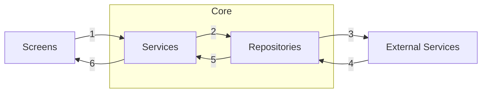
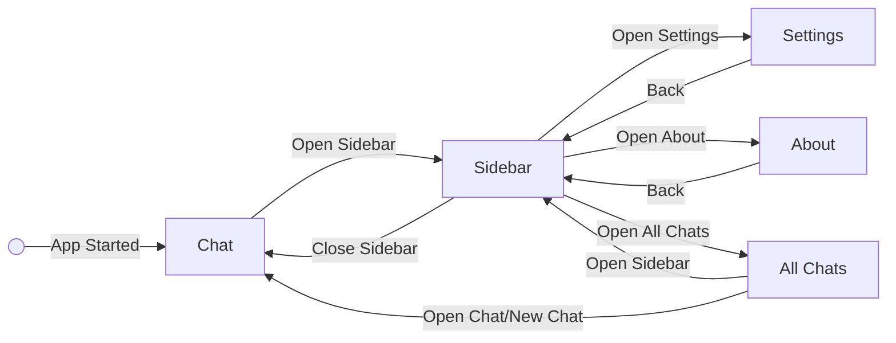
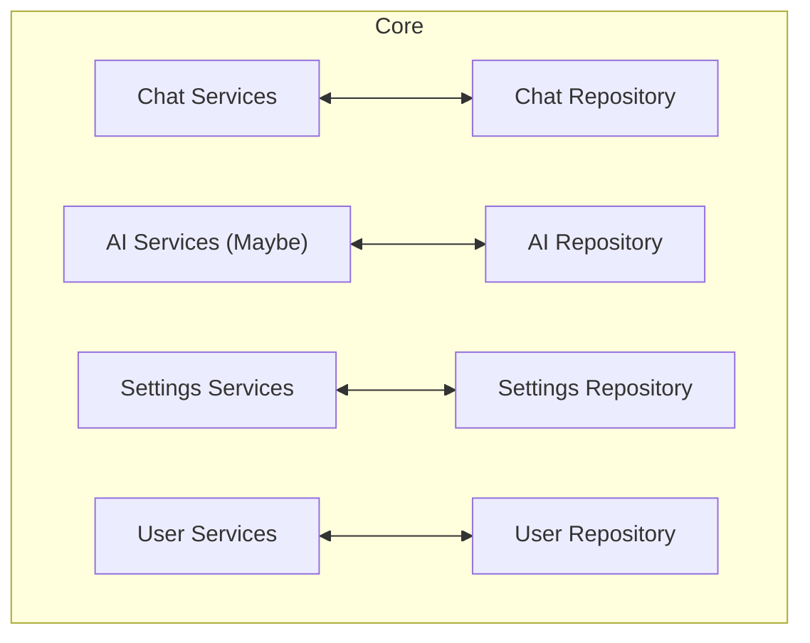
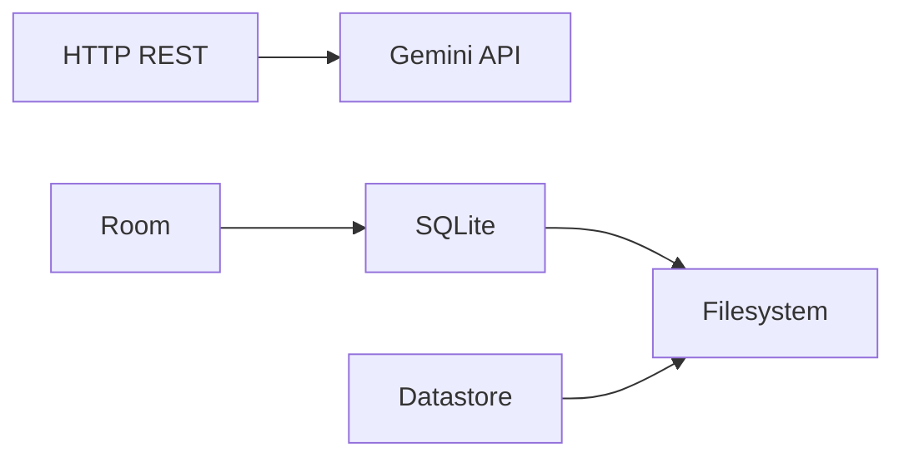
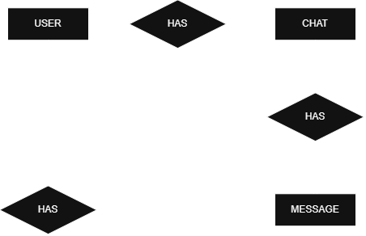

<h1 align="center">DroidMentor</h1>

This repository contains the implementation of the DroidMentor assignment for the PDM(Programação em Dispositivos Móveis) subject in ISEL.

# Index
- [Technologies](#technologies)
- [Group Members](#group-members)
- [Summary](#summary)
- [Application Flowchart](#application-flowchart)
- [Milestones](#milestones)
- [Database](#database)

# Technologies

The list below represents the major technologies used in the development of the project.

# Group Members
|                  Name                  |Number|
|:---------------------------------------|:----:|
|[Ricardo Martins](a52326@alunos.isel.pt)| 52326|
|[Manuel Abreu](a52487@alunos.isel.pt)   | 52487|
|[Maximus Delorey](a52506@alunos.isel.pt)| 52506|

# Summary

### Screens
- Chat
- All Chats
- Sidebar
- About
- Settings

### External Services
- Gemini API
- (Room / SQLite) Storage
- (DataStore) User Credentials

# Application Flowchart

### Screens 

### Core

### External Services 

# Milestones

### Week 1-2
- Backend Core - Services Framework
Verifications of the data provided by the UI
- Backend Core - Repositories Framework:
    - **DB**
        - Chats
        - Settings
        - User
    - **API**
        - AI
- Database architecturing and concept
- Start of Database development
- Domain and DTO definition
- Researching the GEMINI API

### Week 3-4
- Continuing development of Services Framework and Repositories Framework
- Initial concepts and mocks of all UX/UI
- Begining the development of the UX/UI
- Database development and configuration

### Week 5-6
- Continuing development of Services Framework and Repositories Framework
- Continuing development of the UX/UI
- Continuing Database development and configuration

### Week 7-8
- Continuing development of Services Framework and Repositories Framework
- Continuing development of the UX/UI

### Week 9-10
- Refactoring of needed code
- Continuing development of Services Framework and Repositories Framework
- Continuing development of the UX/UI

### Week 11
- Refinement and polishing final code
- Assignment completion

# Database

**Entities**
- Chats
- Messages
- Users

